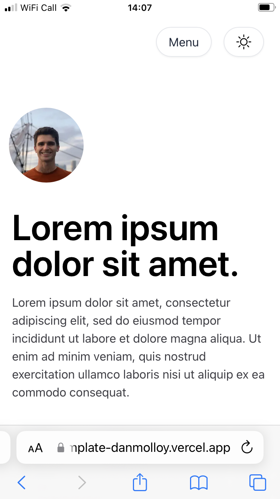
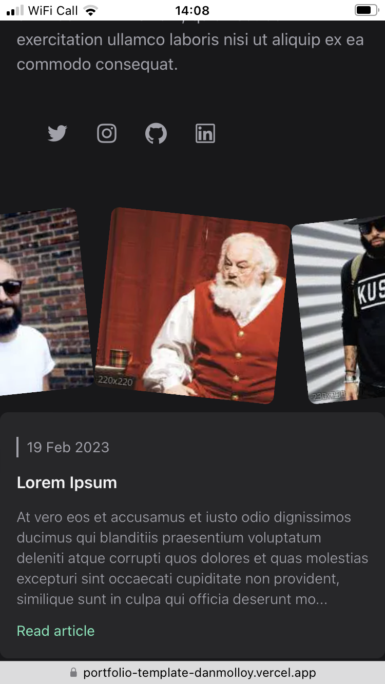
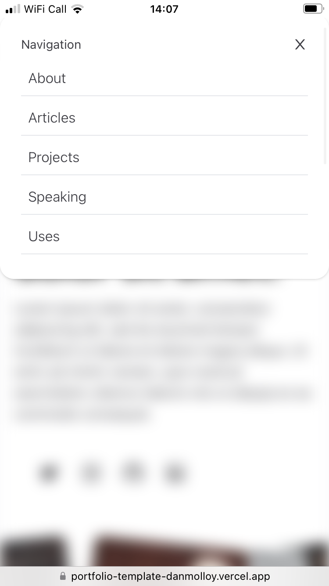

# Personal Website Template
## Overview
As a musician, I've found myself making quite a few personal websites for colleagues. I'm a fan of TailwindUI's [Spotlight template](https://tailwindui.com/templates/spotlight) so decided to style a replica.

## Features
I kept the functionality to a minimum and focused my time on replicating the fantastic styling. A few of my favourite CSS features include:
- Minimising header image on scroll
- Overflowing photo album on the home page
- Highlighted menu links (desktop view only)
- Blurred background when menu shown (mobile view only)
- Dark Mode
- A variety of great usable components for other projects

## Stack
- Tailwind CSS
- Next JS
- TypeScript

## Credit
Many thanks obviously goes to Tailwind UI for such a great template.